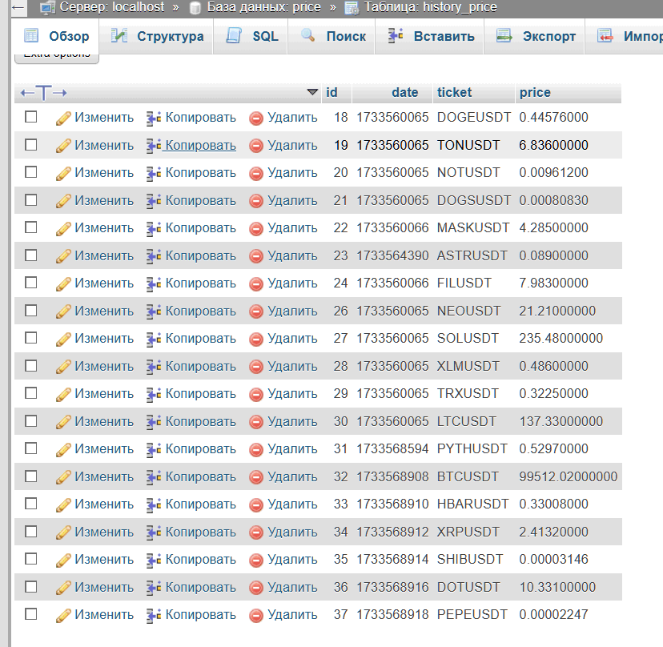

<ol>
<li>Required  root directory edit file .htaccess:

        <IfModule mod_rewrite.c>
            RewriteEngine on
            RewriteBase /

            RewriteCond %{REQUEST_FILENAME} !-d
            RewriteCond %{REQUEST_FILENAME} !-f
            RewriteCond %{REQUEST_FILENAME} !-l

            #add code..................................................

            # CRYPTO APP
            RewriteRule ^crypto/(.*)$ path_to_app/crypto/$1 [L]

            #end add code..............................................

        </IfModule>

</li>
<li>Edit MySql settings on are path: crypto/include/Config.php</li>

<li>open link browser: <a href="http://localhost/crypto/">http://you-domain.com/crypto/</a></li>
</ol>

